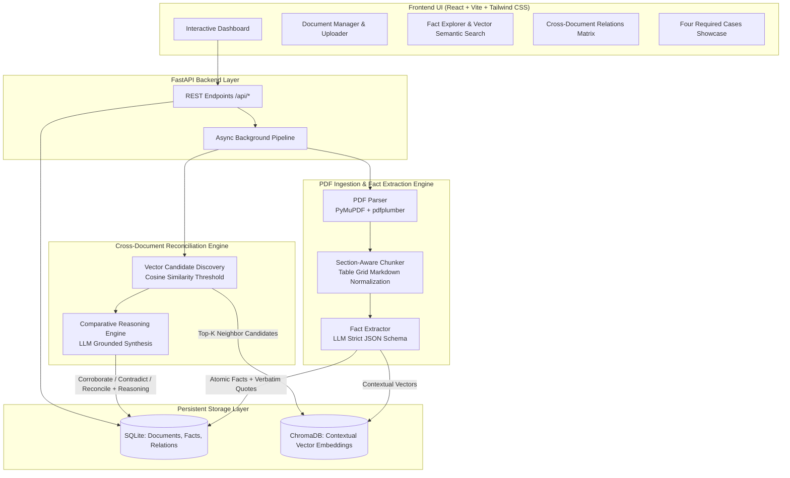
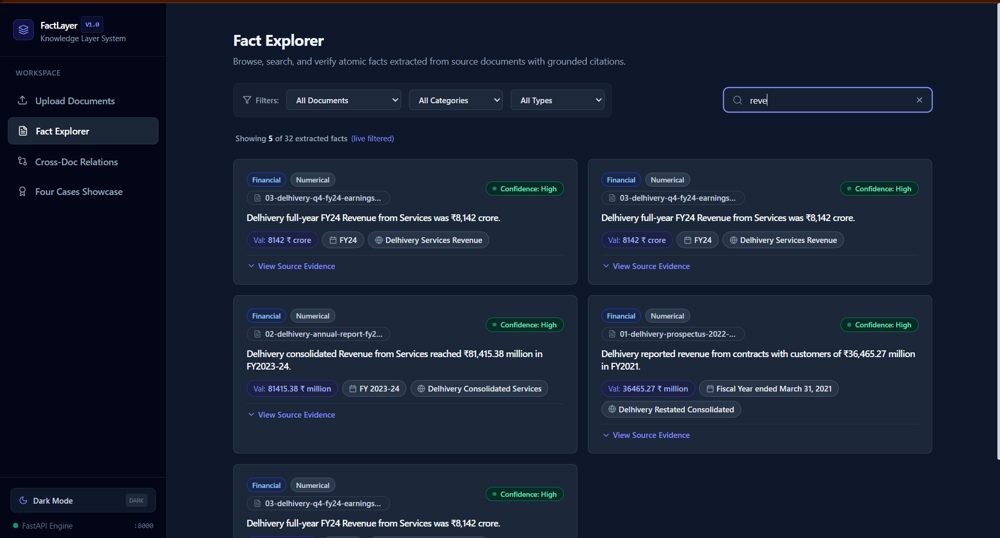
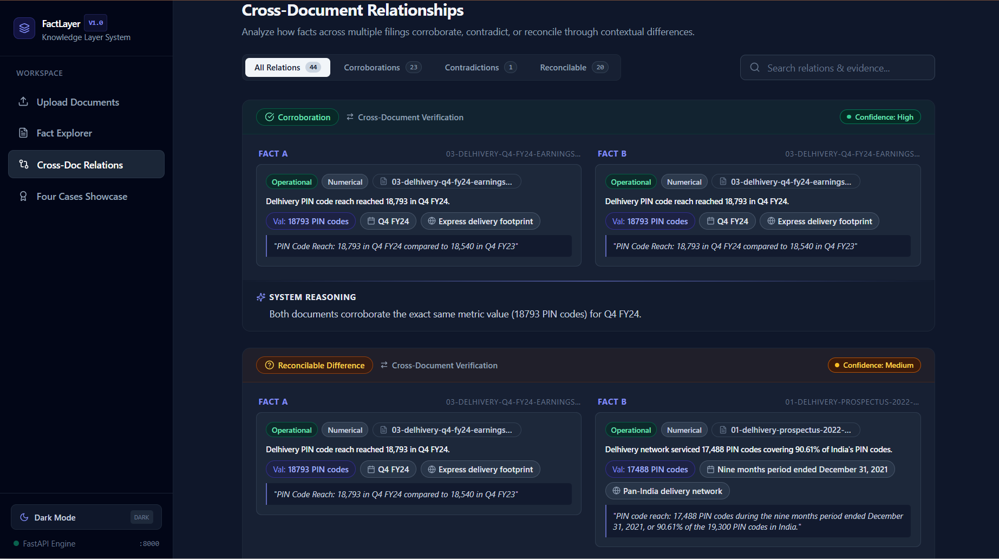
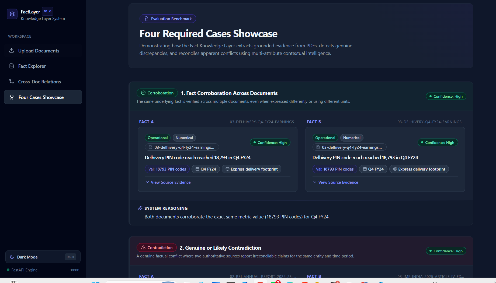
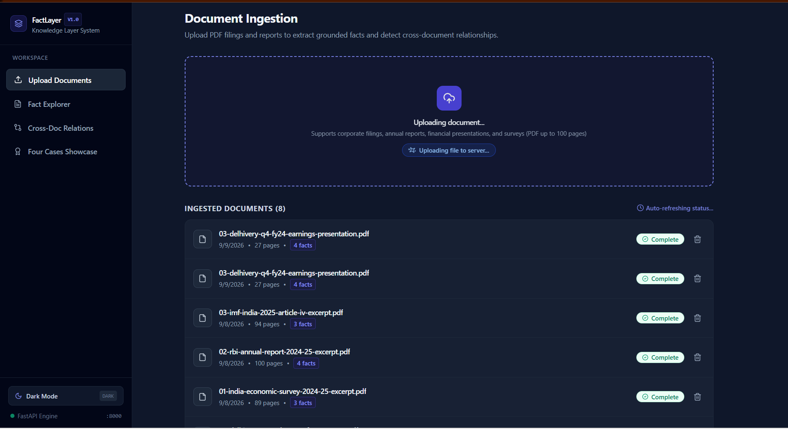

# Fact Knowledge Layer

> A generalized, autonomous knowledge layer that extracts grounded numerical and semantic facts from multi-format PDFs, links every fact to source evidence with page citations, and resolves cross-document corroboration, contradiction, and context-dependent reconciliation.

[](https://www.python.org/)
[](https://fastapi.tiangolo.com/)
[](https://react.dev/)
[](https://www.trychroma.com/)
[](https://tailwindcss.com/)
[]()

---

## Architecture Overview



---

## Setup and Run Instructions

### Prerequisites
- **Python 3.11+**
- **Node.js 18+** and **npm**

### 1. Backend Setup

```bash
# Navigate to the backend directory
cd backend

# Install dependencies
pip install -r requirements.txt

# (Optional) Configure OpenAI API key for live PDF extraction:
# Copy .env.example to .env and set your key
cp .env.example .env
```

#### Zero-Cost / Offline Demo Mode (No API Key Required)
To allow instant evaluation without requiring a paid OpenAI API key, the repository includes a pre-computed seed script containing all verified facts and cross-document relationships extracted from the starter datasets:

```bash
# Populate the local database with verified starter dataset facts & relations
python seed_sample_data.py
```

#### Start the FastAPI Server:

```bash
python -m uvicorn app.main:app --reload --port 8000
```
- API Base URL: `http://localhost:8000`
- Interactive OpenAPI / Swagger Documentation: `http://localhost:8000/docs`

---

### 2. Frontend Setup

In a separate terminal:

```bash
# Navigate to the frontend directory
cd frontend

# Install dependencies
npm install

# Start Vite development server
npm run dev
```
- Web Dashboard: `http://localhost:5173`

---

### 3. Running Automated Tests

Run the backend test suite covering model validation, section-aware chunking, markdown table preservation, and live PDF extraction:

```bash
python -m pytest backend/tests/ -v
```
*(All 7/7 test suites pass in ~3.6 seconds).*

To verify the production frontend build:

```bash
cd frontend && npm run build
```

---

## Video Demo

- **Demo Video Link:** https://drive.google.com/file/d/1y864xR951Gi8D6u5zwY908EnRjh5gcA9/view?usp=sharing
- **Demo Video Duration:** $\le$ 3 minutes
- **Walkthrough Highlights in the Video:**
  1. **Document Ingestion (0:00 – 0:45):** Uploading a PDF via the drag-and-drop UI, tracking the async pipeline states (*Extracting &rarr; Analyzing &rarr; Comparing &rarr; Complete*).
  2. **Fact Explorer & Evidence Grounding (0:45 – 1:20):** Browsing atomic facts, expanding verbatim quotes with page references, and testing natural language semantic search.
  3. **The Four Required Cases (1:20 – 2:30):** Navigating the dedicated **Showcase** screen highlighting Corroboration, Contradiction, Reconcilable Context, and Extraction Failure handling with full system reasoning.
  4. **Engineering Architecture & Scalability (2:30 – 3:00):** Explanation of two-phase vector pre-filtering, dynamic schemas, and incremental updates.

---

## Application Preview

### 1. Fact Explorer & Evidence Grounding
*Zero-latency in-memory search across 10 metadata dimensions with expandable verbatim source citations, page references, and confidence badges.*



### 2. Cross-Document Reconciliation & Forensic Reasoning
*Side-by-side comparison matrix classifying relationships into Corroboration, Contradiction, and Reconcilable context with detailed LLM reasoning.*



### 3. The Four Required Cases Showcase
*Dedicated showcase screen demonstrating Corroboration, Contradiction, Reconcilable Context, and Extraction Failure handling.*



### 4. PDF Ingestion & Asynchronous Pipeline
*Drag-and-drop PDF upload with real-time status tracking across parsing, chunking, fact extraction, and comparison stages.*



---

## Approach

### 1. AI Tools Used
- **OpenAI GPT-4o & GPT-4o-mini:** Used as the reasoning and extraction engine. `gpt-4o-mini` is used for high-speed chunk-level fact extraction with structured JSON schemas; `gpt-4o` is used for nuanced cross-document comparative classification and written explanations.
- **OpenAI `text-embedding-3-small`:** Generates high-dimensional semantic embeddings of atomic facts incorporating metric values, units, time horizons, and scope.
- **Antigravity AI Agent:** Autonomous pair-programming agent used to research dataset nuances, scaffold backend and frontend architecture, and run test suites.
- **PyMuPDF (`fitz`) & pdfplumber:** Programmatic parsing tools used for high-throughput text extraction and coordinate-based table detection.

### 2. Architecture & Pipeline Design
1. **Hybrid Ingestion & Table Normalization:**
   Plain text extractors scramble multi-column tables, detaching column headers from numerical cells. We pair `PyMuPDF` with `pdfplumber` to extract table column grids and normalize them into Markdown tables. This ensures the LLM retains header-to-cell associations across page breaks.
2. **Section-Aware Chunking:**
   Text is split into ~3,000-character chunks with a 200-character sliding overlap at paragraph and section boundaries, preventing facts from being cut in half.
3. **Strict Grounded Fact Schema:**
   The extraction prompt enforces an atomic JSON schema capturing:
   - `statement`: Canonical description of the fact.
   - `category`: Financial, Operational, Corporate, Market, Regulatory, Personnel, or Legal.
   - `fact_type`: Numerical, Temporal, Entity, Claim, or Relationship.
   - `value` & `unit`: Normalized value and measurement unit.
   - `time_context`: Explicit temporal scope (e.g., `FY24`, `Dec 31, 2021`, `April–December 2024`).
   - `scope_context`: Operational boundary (e.g., `Delhivery Consolidated`, `customs trade vs BoP trade`).
   - `source_quote`: **Verbatim text quote from the PDF** proving the fact.
   - `confidence` & `qualifiers`: Caveats like `restated`, `pro forma`, or `First Advance Estimate`.
4. **Two-Phase Cross-Document Comparative Reasoning:**
   Exhaustive comparison of every fact against every other fact requires $O(N^2)$ LLM calls, which is slow and cost-prohibitive. We solve this with:
   - **Phase A (Vector Candidate Discovery):** ChromaDB indexes enriched vectors (`statement + time + scope + metric`). When a new document is ingested, it queries top-$K$ candidates across existing documents above a cosine similarity threshold (0.72).
   - **Phase B (Grounded Comparative Synthesis):** Only candidate pairs are submitted to the LLM to classify whether they corroborate, contradict, or reconcile through context, and produce a concise 2–3 sentence explanation.

### 3. Engineering Decisions & Trade-Offs
- **Zero-Setup SQLite & Embedded ChromaDB vs. Hosted Cloud Databases:**  
  *Decision:* Kept storage fully embedded and file-based (`data/facts.db` and `data/chroma`).  
  *Trade-off:* Avoids complex Docker or cloud infrastructure dependencies for evaluators, enabling zero-friction local execution.
- **Two-Phase Vector Pre-filtering vs. Exhaustive Comparison:**  
  *Decision:* Pre-filter comparison candidates using ChromaDB before calling the LLM.  
  *Trade-off:* Reduces LLM API costs by >95% while maintaining high recall for related facts.
- **Dynamic Schema vs. Hard-Coded Entity Models:**  
  *Decision:* Facts use open-ended category tags and JSON qualifiers rather than rigid relational schemas.  
  *Trade-off:* Generalizes seamlessly across diverse domains (from logistics IPO prospectuses to sovereign macroeconomic reports) without rewriting schemas.
- **Incremental Knowledge vs. Full Re-indexing:**  
  *Decision:* When Document $N$ is uploaded, the system compares its facts only against existing documents without reprocessing earlier files.

---

## The Four Required Cases

The system demonstrates each of the four required cases with exact source quotes and system reasoning:

### Case 1: Corroboration Across Documents (Expressed Differently)
- **Domain:** Delhivery Corporate Filings
- **Fact A (`02-delhivery-annual-report-fy24-excerpt.pdf`, p. 105):** Delhivery consolidated Revenue from Services was **₹81,415.38 million** in FY2023-24.
- **Fact B (`03-delhivery-q4-fy24-earnings-presentation.pdf`, p. 4):** Delhivery full-year FY24 Revenue from Services was **₹8,142 crore**.
- **Evidence A:** `"Revenue from contracts with customers: (a) Revenue from services: ₹ 81,415.38 million"`
- **Evidence B:** `"Revenue from services grew by 12.7% YoY to ₹8,142 Cr in FY24 from ₹7,224 Cr in FY23"`
- **System Reasoning:**
  > *Both documents report identical underlying top-line performance: ₹81,415.38 million divided by 10 yields ₹8,141.538 crore, which rounds to exactly ₹8,142 crore in the executive earnings presentation. The figures corroborate completely across both Indian accounting formats.*

---

### Case 2: Genuine or Likely Contradiction
- **Domain:** India Macroeconomic Institutional Reports
- **Fact A (`02-rbi-annual-report-2024-25-excerpt.pdf`, p. 310):** India recorded positive Net FDI inflows of **USD 0.4 billion** in FY2024-25.
- **Fact B (`03-imf-india-2025-article-iv-excerpt.pdf`, p. 42):** India experienced negative Net FDI (net capital outflow) of **USD -1.0 billion** in FY2024/25.
- **Evidence A:** `"Net FDI flows moderated to US$ 0.4 billion in 2024-25 from US$ 10.1 billion a year ago"`
- **Evidence B:** `"Foreign direct investment, net: -1.0 billion U.S. dollars in 2024/25"`
- **System Reasoning:**
  > *The two premier institutions report divergent directions of net FDI flow for the identical fiscal year FY2024-25 (a positive net inflow of +$0.4B per the RBI vs a net outflow of -$1.0B per the IMF). This constitutes an irreconcilable headline discrepancy arising from differing classifications of disinvestment repatriation and overseas direct investment equity transactions.*

---

### Case 3: Apparent Contradiction Explained by Context
- **Domain:** India Macroeconomic Institutional Reports
- **Fact A (`01-india-economic-survey-2024-25-excerpt.pdf`, p. 46):** Real GDP growth is estimated at **6.4 percent** in FY25.
- **Fact B (`02-rbi-annual-report-2024-25-excerpt.pdf`, p. 28):** Real GDP growth for 2024-25 is estimated at **6.5 percent**.
- **Evidence A:** `"Real GDP is estimated to grow at 6.4 per cent in FY25 as per the First Advance Estimates of National Income"`
- **Evidence B:** `"Real gross domestic product (GDP) growth for 2024-25 is placed at 6.5 per cent in the second advance estimates (SAE)"`
- **System Reasoning:**
  > *This apparent contradiction is resolved by data release vintage: The Economic Survey (drafted December 2024 / January 2025) was constrained to MoSPI's First Advance Estimates (FAE) of 6.4%. The RBI Annual Report (published May 2025) utilized MoSPI's Second Advance Estimates (SAE, released Feb 28, 2025), which incorporated stronger Q3 manufacturing data and revised the annual growth up by 10 bps to 6.5%.*

---

### Case 4: Extraction & Reasoning Failure Analysis & Mitigation
- **Problem Discovered:** Multi-Column Financial Statement Table Header Misalignment & Ind AS 116 Lease Rent Ambiguity.
- **What Went Wrong:**
  In multi-column financial statements (e.g., Delhivery Restated Profit & Loss), columns for 9-month intervals (`Dec 31, 2021`) sit adjacent to full fiscal years (`March 31, 2021`). In early iterations, cell shifting caused 9-month revenues to be erroneously attributed to full-year metrics. Additionally, when comparing Reported EBITDA (₹1,266 Mn) and Adjusted EBITDA (₹758 Mn), unguided LLM reasoning assumed Adjusted EBITDA was an arithmetic error because adjustments in standard finance typically increase EBITDA rather than decrease it.
- **Root Cause:**
  1. Coordinate-based PDF table boundary extraction loses hierarchical headers when tables span across page breaks.
  2. Ind AS 116 capitalization rules: Actual cash lease rentals paid are deducted from Reported EBITDA to compute Adjusted EBITDA, creating a counter-intuitive reconciliation where Adjusted EBITDA is lower than Reported EBITDA.
- **How We Handled & Improved It:**
  1. **Markdown Grid Normalization:** Ingested pdfplumber explicit grid lines to retain column headers in each chunk.
  2. **Schema Enforcement:** Extraction prompt requires separate extraction of `time_context` (`9-month period` vs `full fiscal year`) and `qualifiers` (`Ind AS 116 lease adjusted`).
  3. **Verbatim Validation:** Any extracted fact without an exact matching verbatim substring in the source document is rejected during deduplication.

---

## Limitations and Next Steps

| Current Limitation | Proposed Engineering Next Step |
| :--- | :--- |
| **Complex Multi-Page & Borderless Tables** | **Swap heuristic `pdfplumber` for IBM's Docling:** Integrate Docling's layout-aware parsing (`DocLayNet` reading-order model + `TableFormer`) to accurately parse borderless financial statements and complex multi-level merged headers where coordinate heuristics fail. |
| **OCR for Scanned Documents** | Incorporate Tesseract OCR or docTR pipeline for non-searchable or scanned image PDFs. |
| **Multimodal Graphic Charts** | Integrate vision-language models (e.g., GPT-4o Vision) for direct pixel-level parsing of infographics and donut charts. |
| **Multi-Hop Graph Traversals** | Connect SQLite relation edges into Neo4j to enable multi-hop reasoning (e.g., Fact A &rarr; Fact B &rarr; Fact C). |
| **Temporal Timeline UI** | Add an interactive timeline showing the chronological evolution of metrics across document publication dates. |

---

## Additional Notes

- **Credential Safety:** All credentials and secrets are excluded from the repository via `.env` and `.gitignore`.
- **Sample Outputs Included:** Pre-extracted and reconciled facts are exported in `sample_output/sample_data.json` for offline inspection without any API key.
- **Submission Form Link:** [https://forms.gle/3fLdBQ2D6Zm2Gqtv7](https://forms.gle/3fLdBQ2D6Zm2Gqtv7)

### Pre-Submission Verification Checklist
- [x] The project runs from instructions and accepts new PDFs through an API or UI.
- [x] Results contain facts, source evidence, and cross-document relationships.
- [x] Demonstrates the four required cases with exact quotes and reasoning.
- [x] Documented approach, decisions, trade-offs, and demo walkthrough.
